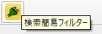
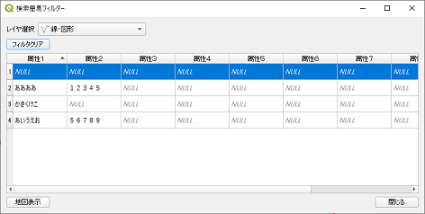
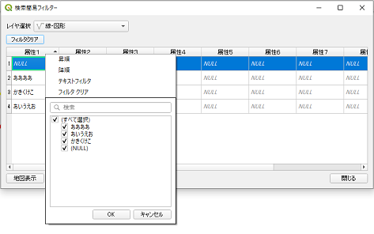
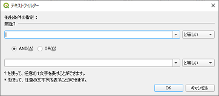
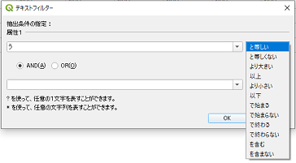

# 検索簡易フィルタープラグイン 利用マニュアル

属性情報のフィルターによって検索するQGISプラグインです。

## 起動

プラグインメニューから「検索簡易フィルター」をクリックします。 
すると、下記のような一覧画面が表示されます。

## 検索一覧画面

属性テーブルが表示されます。初期はアクティブレイヤが選択されます。

|    |    |
| ---- | ---- |
| レイヤ選択 |  プロジェクト内で表示しているレイヤのリストです。  |
| フィルタクリア |  フィルタ条件がクリアされ、すべての地物情報が表示されます。  |
| テーブルヘッダ |  選択したレイヤの属性です。右クリックすると、選択した属性に対するフィルタメニューが表示されます。  |
| テーブル一覧 |  抽出した地物情報です。（編集はできません）  |
| 行番号 |  クリックすると、行が選択状態になり、また、地図上で該当する地物が選択されます。  |
| 地図表示ボタン |  クリックすると、選択した地物にズームします。  |

## フィルター設定メニュー

並び替えや、フィルター内容を設定します。

|    |    |
| ---- | ---- |
| 昇順 |  選択した属性を昇順に並び替えます。  |
| 降順 |  選択した属性を降順に並び替えます。  |
| テキストフィルター |  下記のようなテキストフィルターダイアログが表示されます。  |
| フィルタークリア |  選択した属性のフィルタ条件がクリアされ、再抽出および表示されます。  |
| 検索 |  下記リストをあいまい検索します。  |
| リスト |  「OK」ボタンをクリックすると、チェックしたものを属性テーブルに表示します。  |

## テキストフィルター

選択した属性に対し、任意の文字列と演算内容で抽出します。

|    |    |
| ---- | ---- |
| テキスト入力欄  |  テキスト入力欄です。（矢印▼は地物の属性内容リストで選択できます）  |
| 演算内容 |  演算内容です。 |
| AND/OR |  １つ目のフィルターと２つ目のフィルターの接続条件です。 |
| OKボタン |  設定した内容でフィルターをします。（他の属性フィルターがあれば含めて抽出します） |
| 閉じるボタン |  ダイアログを閉じます。 |
